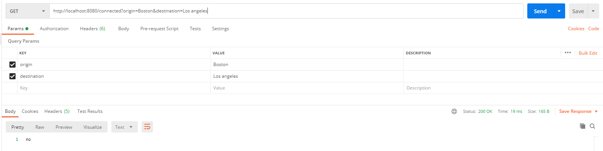
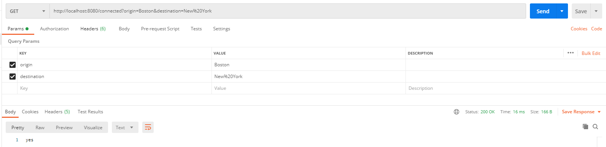
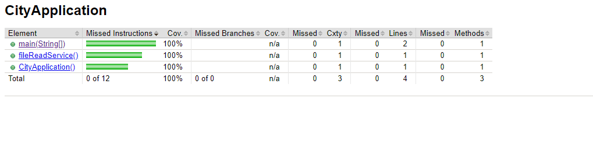

### Route finder between two cities. ###

This project contains single endpoint named "/connected".It accepts a two request params 'origin' and 'destination'.
This can be accessible by "http://host:port/connected".

### How do I get set up? ###

Project contains application class named "CityApplication.java", We can run this file as java application and our spring boot application is up. 

In this project '/src/main/resources' contains file named "city.txt", from where we are checking whether route is available or not. 

We configured 'city.txt' file in '/src/main/resources/application.properties', we can change the file name from this config file.

### Request Response###

### Code Coverage###

